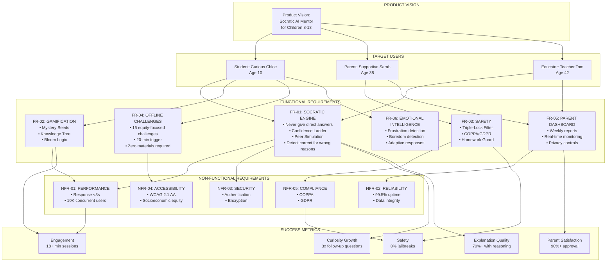
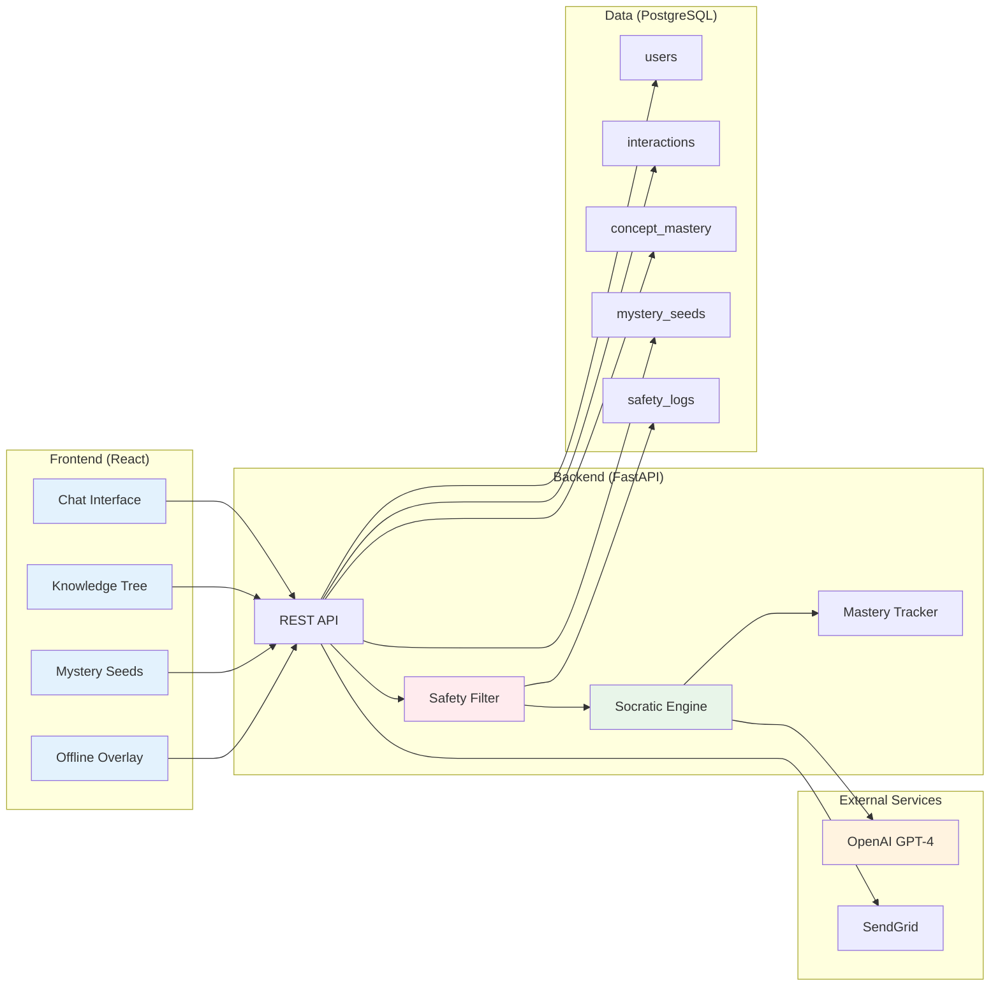

# PRD Requirements Map
**Visual Overview of Eco-Mind AI Requirements**

---

## 🗺️ REQUIREMENTS ARCHITECTURE



---

## 📋 REQUIREMENTS TRACEABILITY MATRIX

### How Each Requirement Supports User Needs

| Requirement | Student Needs | Parent Needs | Educator Needs | Success Metric |
|-------------|---------------|--------------|----------------|----------------|
| **FR-01: Socratic Engine** | ✅ Feel smart by figuring things out | ✅ Evidence of real thinking | ✅ Reinforces classroom method | KPI-01, KPI-02 |
| **FR-02: Gamification** | ✅ Fun, visual progress | ✅ Transparent progress tracking | ✅ Engagement data | KPI-03 |
| **FR-03: Safety** | ✅ Safe environment | ✅ Peace of mind | ✅ No inappropriate content | KPI-04 |
| **FR-04: Offline Challenges** | ✅ Screen-time balance | ✅ Physical activity | ✅ Real-world application | KPI-13 |
| **FR-05: Parent Dashboard** | ✅ Parent involvement | ✅ Visibility into learning | ✅ Parent-teacher alignment | KPI-05 |
| **FR-06: Emotional Intelligence** | ✅ Frustration support | ✅ Prevents burnout | ✅ Adaptive learning | KPI-03 |

---

## 🎯 REQUIREMENT DEPENDENCIES

### Critical Path (Must Build First)

```
1. FR-01: Socratic Engine
   ↓
2. FR-03: Safety (Triple-Lock)
   ↓
3. FR-02: Gamification (Mystery Seeds)
   ↓
4. FR-06: Emotional Intelligence
   ↓
5. FR-04: Offline Challenges
   ↓
6. FR-05: Parent Dashboard
```

**Why This Order?**
- **FR-01** is the core value proposition
- **FR-03** must wrap FR-01 for safety
- **FR-02** rewards engagement from FR-01
- **FR-06** enhances FR-01 with adaptivity
- **FR-04** balances screen time from FR-02
- **FR-05** provides transparency for parents

---

## 🔄 USER FLOW → REQUIREMENTS MAPPING

### Student Journey: "Login to Earning a Mystery Seed"

| User Flow Step | Requirements Involved | Success Metric |
|----------------|----------------------|----------------|
| **1. Login** | NFR-03 (Authentication) | - |
| **2. View Dashboard** | FR-02 (Knowledge Tree), NFR-01 (Performance) | - |
| **3. Ask Question** | FR-01 (Socratic Engine), FR-03 (Safety Filter) | KPI-01 |
| **4. Socratic Dialogue** | FR-01 (Confidence Ladder, Peer Simulation), FR-06 (Emotional Intelligence) | KPI-01, KPI-02 |
| **5. Mystery Seed Drop** | FR-02 (Gamification) | KPI-03 |
| **6. Seed Blooms** | FR-02 (Bloom Logic) | KPI-03 |
| **7. Offline Challenge** | FR-04 (Challenges), NFR-04 (Equity) | KPI-13 |
| **8. Session End** | NFR-02 (Data Integrity) | KPI-03 |

### Parent Journey: "Checking Weekly Report"

| User Flow Step | Requirements Involved | Success Metric |
|----------------|----------------------|----------------|
| **1. Receive Email** | FR-05 (Weekly Report) | KPI-11 |
| **2. Open Report** | FR-05 (Report Content), NFR-01 (Performance) | KPI-11 |
| **3. Review Dashboard** | FR-05 (Real-Time Dashboard), NFR-03 (Authentication) | KPI-05 |
| **4. Emotional Response** | FR-05 (Insights), FR-01 (Curiosity Metrics) | KPI-05 |

---

## 📊 REQUIREMENTS PRIORITY MATRIX

### P0 (Must Have) - Blocks MVP Launch

| ID | Requirement | Complexity | Risk | Effort |
|----|-------------|------------|------|--------|
| FR-01 | Socratic Engine | High | Medium | 2 weeks |
| FR-02 | Gamification | Medium | Low | 1.5 weeks |
| FR-03 | Safety (Triple-Lock) | High | High | 1 week |
| NFR-01 | Performance (<3s response) | Medium | Medium | Ongoing |
| NFR-03 | Security (Auth, Encryption) | Medium | High | 1 week |
| NFR-05 | COPPA/GDPR Compliance | Low | High | 1 week |

**Total P0 Effort**: ~4 weeks (with parallel work)

### P1 (Should Have) - Enhances MVP

| ID | Requirement | Complexity | Risk | Effort |
|----|-------------|------------|------|--------|
| FR-04 | Offline Challenges | Low | Low | 3 days |
| FR-05 | Parent Dashboard | Medium | Low | 1 week |
| FR-06 | Emotional Intelligence | Medium | Medium | 1 week |
| NFR-04 | Accessibility (WCAG 2.1) | Medium | Low | 1 week |

**Total P1 Effort**: ~2 weeks

### P2 (Nice to Have) - Future Versions

- Multiplayer learning
- Teacher dashboard
- Voice interface
- Mobile apps
- Advanced analytics

---

## 🧩 TECHNICAL ARCHITECTURE → REQUIREMENTS

### How Technical Components Support Requirements



**Component → Requirement Mapping**:
- **Chat Interface** → FR-01 (Socratic Engine)
- **Knowledge Tree** → FR-02 (Gamification)
- **Mystery Seeds** → FR-02 (Gamification)
- **Offline Overlay** → FR-04 (Challenges)
- **Safety Filter** → FR-03 (Safety)
- **Socratic Engine** → FR-01 (Pedagogy)
- **Mastery Tracker** → FR-02 (Bloom Logic)

---

## 🎯 ACCEPTANCE CRITERIA SUMMARY

### How We Know Each Requirement is Complete

| Requirement | Key Acceptance Criteria | Testing Method |
|-------------|------------------------|----------------|
| **FR-01: Socratic Engine** | 95%+ responses contain question mark | Automated testing + human review |
| **FR-02: Mystery Seeds** | Seed drop animation <2s, cooldown prevents spam | Integration testing |
| **FR-03: Safety** | 100% PII scrubbing, 0% jailbreaks | Adversarial testing, 1000+ samples |
| **FR-04: Offline Challenges** | 100% require zero materials | User testing with diverse families |
| **FR-05: Parent Dashboard** | Report generated every Sunday 8 AM | Automated testing |
| **FR-06: Emotional Intelligence** | Frustration detected 80%+ accuracy | Labeled dataset testing |
| **NFR-01: Performance** | 95th percentile <3s response | Load testing |
| **NFR-03: Security** | SSL Labs A+, penetration testing passes | Security audit |
| **NFR-04: Accessibility** | WCAG 2.1 AA compliance | Automated + manual testing |
| **NFR-05: Compliance** | Legal review confirms COPPA/GDPR | Legal audit |

---

## 📈 REQUIREMENTS → KPIs MAPPING

### How Each Requirement Drives Success Metrics

```mermaid
graph TD
    FR01[FR-01: Socratic Engine] --> KPI01[KPI-01: Curiosity Growth<br/>3x follow-up questions]
    FR01 --> KPI02[KPI-02: Explanation Quality<br/>70%+ with reasoning]
    
    FR02[FR-02: Gamification] --> KPI03[KPI-03: Session Duration<br/>18+ minutes]
    FR02 --> KPI12[KPI-12: Concepts Mastered<br/>3+ per week]
    
    FR03[FR-03: Safety] --> KPI07[KPI-07: Jailbreak Rate<br/>0%]
    FR03 --> KPI08[KPI-08: PII Scrubbing<br/>100%]
    
    FR04[FR-04: Offline Challenges] --> KPI13[KPI-13: Challenge Completion<br/>70%+]
    
    FR05[FR-05: Parent Dashboard] --> KPI10[KPI-10: Parent Approval<br/>90%+]
    FR05 --> KPI11[KPI-11: Report Open Rate<br/>80%+]
    
    FR06[FR-06: Emotional Intelligence] --> KPI03
    FR06 --> KPI05[KPI-05: Weekly Retention<br/>70%+]
    
    NFR01[NFR-01: Performance] --> KPI03
    NFR04[NFR-04: Accessibility] --> KPI13
    NFR05[NFR-05: Compliance] --> KPI07
    
    style KPI01 fill:#C8E6C9
    style KPI02 fill:#C8E6C9
    style KPI03 fill:#BBDEFB
    style KPI07 fill:#FFCDD2
    style KPI10 fill:#F0F4C3
```



---

## 🚀 IMPLEMENTATION PHASES

### How Requirements Map to Development Timeline

#### **Phase 1: Core MVP (Weeks 1-2)**
- ✅ FR-01: Socratic Engine (basic)
- ✅ FR-03: Safety Filter (PII + Content)
- ✅ NFR-01: Performance (basic)
- ✅ NFR-03: Security (auth)

**Deliverable**: Working chat with Socratic responses and safety

---

#### **Phase 2: Gamification (Weeks 3-4)**
- ✅ FR-02: Mystery Seeds
- ✅ FR-02: Knowledge Tree
- ✅ FR-02: Bloom Logic
- ✅ NFR-01: Performance (optimization)

**Deliverable**: Full gamification system

---

#### **Phase 3: Engagement & Safety (Week 5)**
- ✅ FR-04: Offline Challenges
- ✅ FR-06: Emotional Intelligence
- ✅ FR-03: Safety (jailbreak detection)
- ✅ NFR-05: COPPA/GDPR compliance

**Deliverable**: Screen-time balance and adaptive responses

---

#### **Phase 4: Parent Features (Week 6)**
- ✅ FR-05: Parent Dashboard
- ✅ FR-05: Weekly Reports
- ✅ NFR-04: Accessibility
- ✅ NFR-02: Reliability

**Deliverable**: Parent transparency and monitoring

---

## 🎓 REQUIREMENTS VALIDATION CHECKLIST

### Before Declaring "Done"

#### Functional Requirements:
- [ ] FR-01: Socratic Engine tested with 100+ question types
- [ ] FR-02: Mystery Seeds bloom correctly for all 4 seed types
- [ ] FR-03: Safety filter passes adversarial testing (red team)
- [ ] FR-04: All 15 offline challenges tested with diverse users
- [ ] FR-05: Parent dashboard loads in <2s with real data
- [ ] FR-06: Emotional intelligence detects frustration/boredom accurately

#### Non-Functional Requirements:
- [ ] NFR-01: Load testing confirms 10K concurrent users
- [ ] NFR-02: 99.5% uptime achieved in staging for 1 week
- [ ] NFR-03: Penetration testing finds no critical vulnerabilities
- [ ] NFR-04: WCAG 2.1 AA compliance verified by audit
- [ ] NFR-05: Legal counsel approves COPPA/GDPR implementation

#### Success Metrics:
- [ ] KPI tracking implemented in analytics dashboard
- [ ] Baseline metrics established (pre-launch)
- [ ] A/B testing framework ready for optimization

---

## 📞 QUESTIONS & CLARIFICATIONS

### Common Questions About Requirements

**Q: Can we skip the Confidence Ladder for V1?**  
A: ❌ No. This is P0 (FR-01.2). It's core to the Socratic method and prevents student frustration.

**Q: Do we need all 15 offline challenges for launch?**  
A: ✅ Yes, but they're low complexity (P1). Ensures equity and variety.

**Q: Can we use GPT-3.5 instead of GPT-4 to save costs?**  
A: ⚠️ Risky. GPT-4 is better at maintaining Socratic pedagogy. Consider GPT-3.5 as fallback only.

**Q: Is WCAG 2.1 AA compliance required for MVP?**  
A: ⚠️ P1 (should have). Critical for equity, but can be enhanced post-launch.

**Q: How do we measure "curiosity growth" before launch?**  
A: Establish baseline with beta users (Week 5), then track improvement over time.

---

## 🎉 FINAL CHECKLIST

### Is This PRD Complete?

- [x] Product vision clearly stated
- [x] Target personas defined with pain points
- [x] All functional requirements have acceptance criteria
- [x] Non-functional requirements are measurable
- [x] User flows documented end-to-end
- [x] Success metrics defined with targets
- [x] Out of scope explicitly stated
- [x] Dependencies and assumptions documented
- [x] Links to technical specs provided
- [x] Approval process defined

**Status**: ✅ **PRD is COMPLETE and READY for implementation!**

---

**Next Step**: Schedule PRD review meeting with all stakeholders → Development kickoff!
