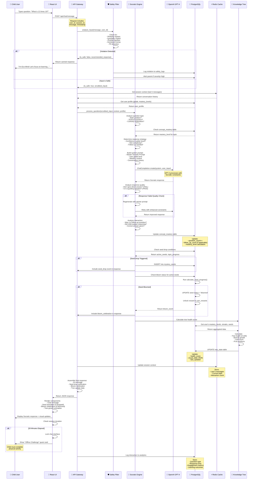
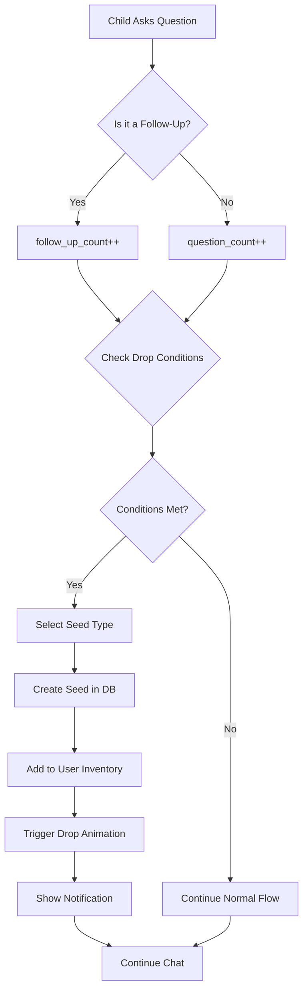
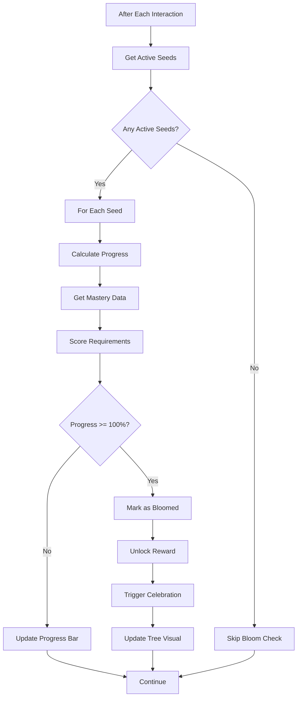
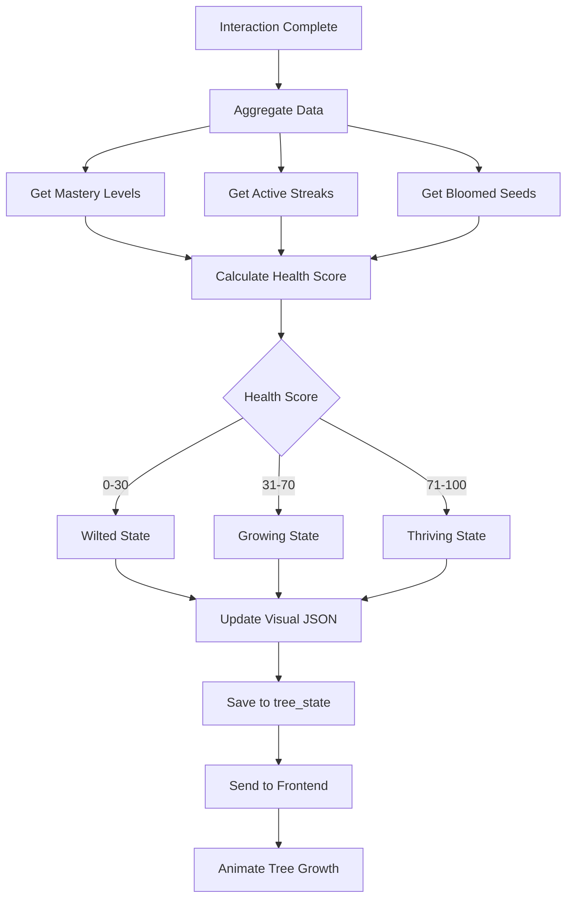
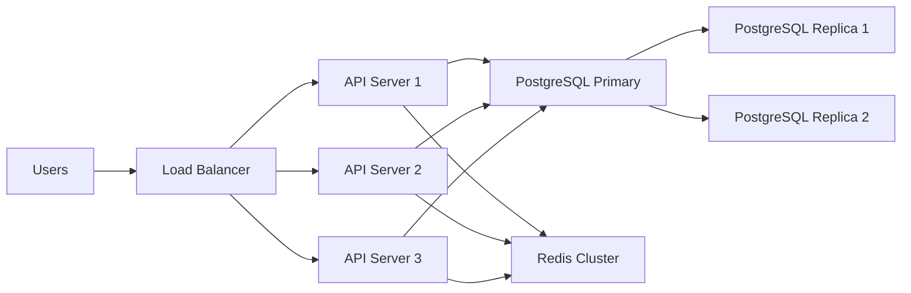

# Eco-Mind System Architecture
**Version**: 1.0  
**Purpose**: Complete system architecture showing the "Life of a Request" from user input to database update

---

## ARCHITECTURE OVERVIEW

The Eco-Mind system follows a **layered microservices architecture** with 5 core layers:

1. **Client Layer** (React Native/Web)
2. **API Gateway** (FastAPI)
3. **Safety Layer** (Content Filter + PII Scrubber)
4. **Intelligence Layer** (Socratic Engine + LLM)
5. **Data Layer** (PostgreSQL + Redis)

---

## LIFE OF A REQUEST - MERMAID DIAGRAM



---

## DETAILED COMPONENT BREAKDOWN

### 1. Client Layer (React Native/Web)
**Responsibilities**:
- Render chat interface
- Display Knowledge Tree visualization
- Handle Mystery Seed animations
- Trigger offline challenges
- Manage local state (typing indicators, optimistic updates)

**Technologies**:
- React Native (iOS/Android) or Next.js (Web)
- Framer Motion (animations)
- WebSocket (real-time updates)

---

### 2. API Gateway (FastAPI)
**Responsibilities**:
- Route requests to appropriate services
- Manage authentication/authorization
- Rate limiting (prevent spam)
- Request/response logging

**Endpoints**:
```python
POST   /api/chat/message          # Send user message
GET    /api/tree/state             # Get Knowledge Tree state
GET    /api/seeds/inventory        # Get user's seeds
POST   /api/challenges/complete    # Mark offline challenge done
GET    /api/parent/insights        # Parent dashboard data
```

**Technologies**:
- FastAPI (Python async framework)
- JWT authentication
- CORS middleware

---

### 3. Safety Layer
**Responsibilities**:
- Detect jailbreak attempts
- Scrub PII (Personal Identifiable Information)
- Log violations
- Trigger parent alerts

**Implementation**: `backend/safety_filter.py`

**Flow**:
```python
def process_message(message, user_id, session_id):
    # Step 1: Safety check
    safety_result = safety_filter.analyze_input(message, user_id, session_id)
    
    if not safety_result['is_safe']:
        # Return canned response, don't call LLM
        return {
            'response': safety_result['recommended_response'],
            'source': 'safety_filter',
            'violation_logged': True
        }
    
    # Step 2: Use scrubbed input
    clean_message = safety_result['scrubbed_input']
    
    # Continue to Socratic Engine...
```

---

### 4. Intelligence Layer (Socratic Engine + LLM)

#### 4.1 Socratic Engine
**Responsibilities**:
- Analyze question type and complexity
- Retrieve user's mastery context
- Build appropriate LLM prompt
- Validate LLM response (ensure no direct answers)
- Update mastery tracking

**Core Logic**:
```python
class SocraticEngine:
    def process_question(self, question, user_profile, conversation_history):
        # 1. Classify question
        question_type = self.classify_question(question)
        
        # 2. Get mastery context
        mastery_level = db.get_concept_mastery(
            user_id=user_profile['id'],
            concept=question_type['concept']
        )
        
        # 3. Build system prompt
        system_prompt = self.build_prompt(
            base_prompt=MASTER_SOCRATIC_PROMPT,
            grade_level=user_profile['grade'],
            mastery_level=mastery_level,
            conversation_history=conversation_history
        )
        
        # 4. Call LLM
        response = openai.ChatCompletion.create(
            model="gpt-4",
            messages=[
                {"role": "system", "content": system_prompt},
                {"role": "user", "content": question}
            ],
            temperature=0.7,
            max_tokens=200
        )
        
        # 5. Validate response
        if self.contains_direct_answer(response):
            # Regenerate with stricter constraints
            response = self.regenerate_stricter(question, system_prompt)
        
        # 6. Update mastery
        self.update_mastery(user_profile['id'], question_type, response)
        
        return response
```

#### 4.2 LLM Integration
**Provider**: OpenAI GPT-4 (or Anthropic Claude 3)

**Prompt Structure**:
```
SYSTEM: [Master Socratic Prompt + User Context]
USER: [Scrubbed question]
ASSISTANT: [Socratic response - never direct answer]
```

**Quality Assurance**:
- Regex check: Does response contain "the answer is"? → FAIL
- Sentiment analysis: Is tone encouraging? → PASS
- Question detection: Does response end with "?"? → PASS

---

### 5. Data Layer

#### 5.1 PostgreSQL (Persistent Storage)
**Tables**:
1. `users` - User profiles, grade levels, settings
2. `concept_mastery` - Learning progress per topic
3. `mystery_seeds` - Seed inventory and bloom status
4. `tree_state` - Knowledge Tree visual state
5. `safety_logs` - Violation tracking
6. `parent_alerts` - Notifications for parents
7. `analytics` - Interaction metrics

**Schema Example**:
```sql
-- Concept Mastery Table
CREATE TABLE concept_mastery (
    mastery_id UUID PRIMARY KEY,
    user_id UUID REFERENCES users(user_id),
    concept_name VARCHAR(100) NOT NULL,
    topic_category VARCHAR(50),
    mastery_level VARCHAR(20), -- 'exposure', 'understanding', 'mastery'
    question_count INTEGER DEFAULT 0,
    correct_count INTEGER DEFAULT 0,
    follow_up_count INTEGER DEFAULT 0,
    explanation_quality_avg FLOAT,
    last_interaction TIMESTAMP,
    created_at TIMESTAMP DEFAULT NOW()
);

-- Index for fast lookups
CREATE INDEX idx_user_concept ON concept_mastery(user_id, concept_name);
```

#### 5.2 Redis (Session Cache)
**Cached Data**:
- Conversation history (last 5 messages)
- Current topic context
- Session duration (for offline challenge trigger)
- Temporary interaction counts

**TTL**: 24 hours (auto-expire)

**Example**:
```python
# Store session context
redis.setex(
    f"session:{session_id}",
    86400,  # 24 hours
    json.dumps({
        'messages': last_5_messages,
        'current_topic': 'multiplication',
        'interaction_count': 12,
        'session_start': timestamp
    })
)
```

---

## DATA FLOW DIAGRAMS

### Diagram 1: Mystery Seed Drop Flow


### Diagram 2: Bloom Check Flow


### Diagram 3: Knowledge Tree Update Flow


---

## SCALABILITY CONSIDERATIONS

### Load Balancing


### Caching Strategy
1. **L1 Cache** (Redis): Session data, conversation history
2. **L2 Cache** (CDN): Static assets, tree visualizations
3. **Database Query Cache**: Frequently accessed mastery data

### Performance Targets
- **API Response Time**: < 500ms (p95)
- **LLM Response Time**: < 2.5 seconds (p95)
- **Database Query Time**: < 50ms (p95)
- **Tree Render Time**: < 100ms

---

## SECURITY LAYERS

### Layer 1: Input Validation
- Sanitize all user input
- Limit message length (500 chars)
- Rate limiting (10 messages/minute)

### Layer 2: Safety Filter
- PII scrubbing before LLM
- Jailbreak detection
- Content filtering

### Layer 3: Authentication
- JWT tokens (15-minute expiry)
- Refresh tokens (7-day expiry)
- Parent PIN for dashboard access

### Layer 4: Data Encryption
- TLS 1.3 for all API calls
- Encrypted database fields (PII)
- Encrypted backups

---

## MONITORING & OBSERVABILITY

### Metrics to Track
1. **System Health**:
   - API uptime (target: 99.9%)
   - Database connection pool usage
   - Redis hit rate

2. **Performance**:
   - Request latency (p50, p95, p99)
   - LLM response time
   - Database query performance

3. **Business Metrics**:
   - Daily Active Users (DAU)
   - Average session duration
   - Mystery Seed drop rate
   - Bloom conversion rate

### Alerting
- **Critical**: API down, database unreachable
- **Warning**: High latency (>3s), low Redis hit rate
- **Info**: Unusual traffic patterns, new violation types

---

## DISASTER RECOVERY

### Backup Strategy
- **Database**: Automated daily backups (retained 30 days)
- **Redis**: Persistence enabled (AOF + RDB)
- **User Data**: Encrypted backups to S3

### Recovery Time Objectives
- **RTO** (Recovery Time Objective): 1 hour
- **RPO** (Recovery Point Objective): 15 minutes

---

**End of System Architecture Document**
